# Penggantian Baterai Internal 1/2 AA
***

- [x] `Step 01` - Sisi kanan dan sisi kiri logger

: 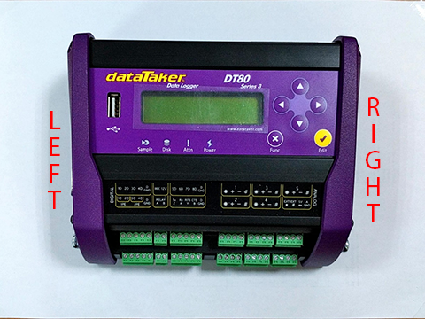{: loading=lazy }

- [x] `Step 02` - Buka baut penutup logger sisi kanan

: 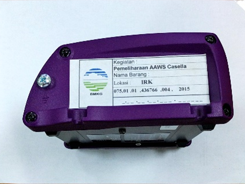{: loading=lazy }

- [x] `Step 03` - Penutup logger sisi kanan yg telah terbuka

: 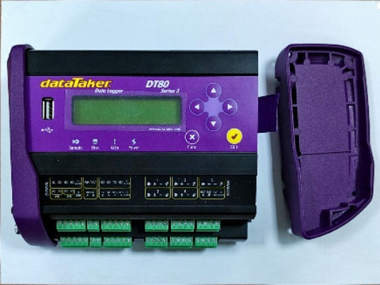{: loading=lazy }

- [x] `Step 04` - Buka baut penutup logger sisi kiri

: 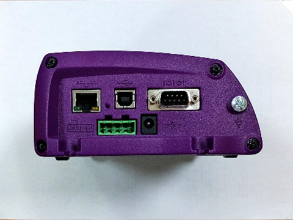{: loading=lazy }

- [x] `Step 05` - Penutup sisi kanan dan kiri logger yg telah terbuka

: 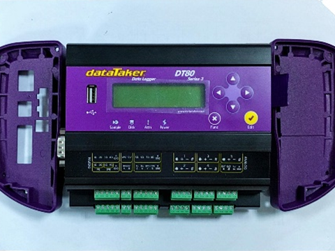{: loading=lazy }

- [x] `Step 06` - Buka baut bagian belakang data logger

: 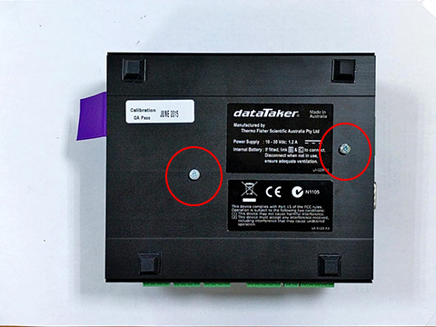{: loading=lazy }

- [x] `Step 07` - Tarik tali warna ungu untuk mengeluarkan baterai 6V

: 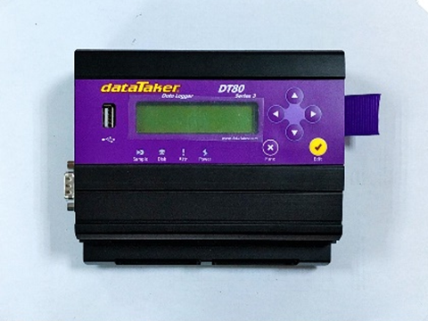{: loading=lazy }

- [x] `Step 08` - Setelah baterai 6V dikeluarkan, keluarkan sedikit board data logger secara perlahan

: 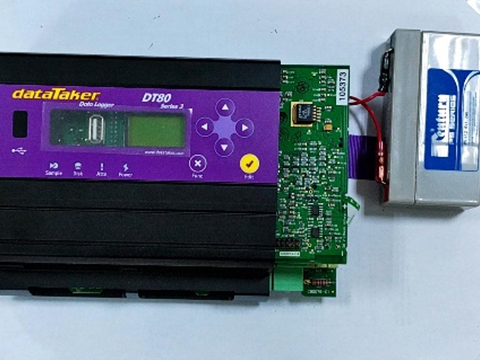{: loading=lazy }

- [x] `Step 09` - Posisi baterai 1/2 AA 3,6V logger berada diantara board data logger

: 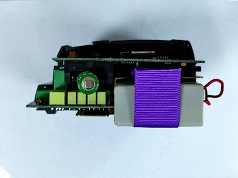{: loading=lazy }

- [x] `Step 10` - Keluarkan secara perlahan baterai 1/2 AA dengan bantuan obeng kecil. {==HARAP BERHATI-HATI AGAR TIDAK ADA PIN YANG PATAH!!!==}. Lakukan penggantian baterai 1/2 AA dengan baterai baru

: 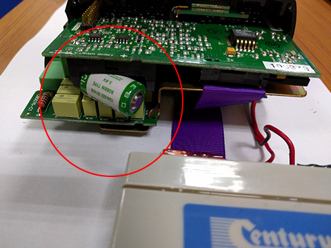{: loading=lazy }

- [x] `Step 11` - Setelah penggantian baterai 1/2 AA selesai dilakukan, pasang kembali board dan baterai 6V seperti semula

: 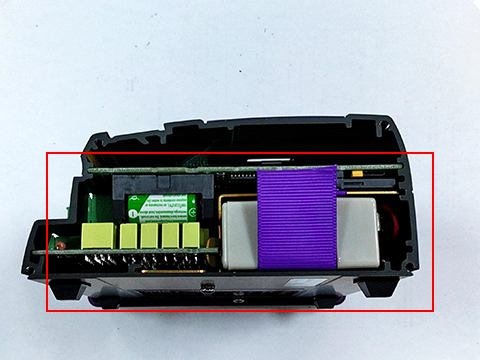{: loading=lazy }

- [x] `Step 12` - Pasang kembali baut belakang data logger lalu pasang juga penutup kanan dan kiri data logger. Selesai.

: 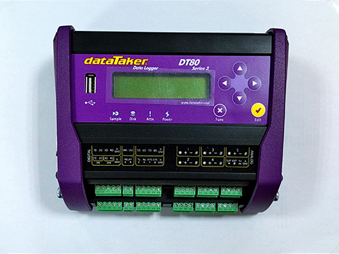{: loading=lazy }

