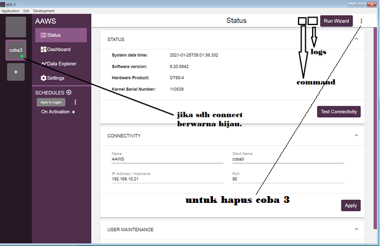
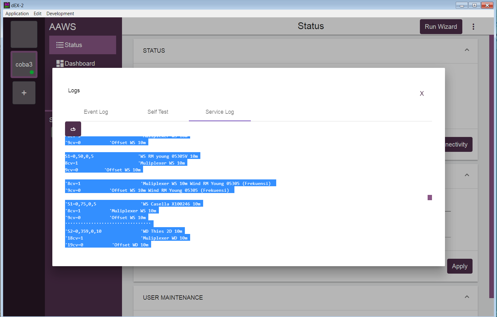

# Setting Logger dengan Aplikasi dEX-2
***

- [x] `Step 01` - Silahkan download aplikasi dEX-2 melalui link yang telah diberikan pada bagian {==Software==}

- [x] `Step 02` - Lalu lakukan install aplikasi tersebut pada PC/Notebook

- [x] `Step 03` - Setting PC/Notebook dengan IP 192.168.10.13 lalu koneksikan logger ke PC/Notebook menggunakan kabel LAN

- [x] `Step 04` - Buka aplikasi dEX. Klik tanda + yang ada pada panel disebelah kiri untuk membuat profile. Isikan {==Name: AAWS (atau lainnya)==}, {==Shortname: AAWS (atau boleh dokosongkan)==}, {==IP Address: 192.168.10.21 (IP Address logger)==}, {==Port: 80==} lalu klik Apply dan tes connectivity

- [x] `Step 05` - Jika connect maka tampilan yang muncul seperti gambar berikut

: {: loading=lazy }

!!! notes
    Kegunaan icon button pada aplikasi dEX-2:

    - [x] {==Command==}: Untuk upload program, time, IP Address, dll. Upload script program menggunakan dEX harus dicopy dan dienter  per baris

    - [x] {==Logs==}: Untuk retrieve program yang di logger. Klik *logs > pilih service log > klik service log (jika di logger muncul tanda seru berwarna merah, maka tekan tanda panah ke bawah pada logger)*. Lalu select baris program dari begin sampai run and jobs, copy ke notepad++ dan save.

    : {: loading=lazy }

    - [x] Download data: pilih menu *Data Explorer > Isi range, start and end time > Download*
