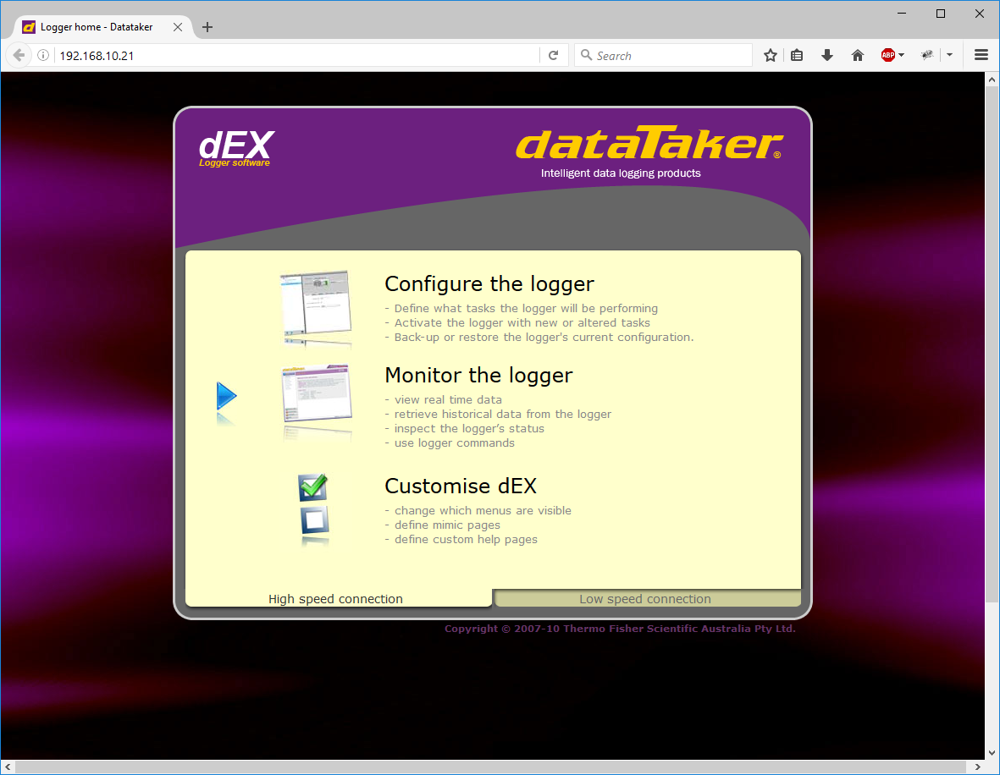
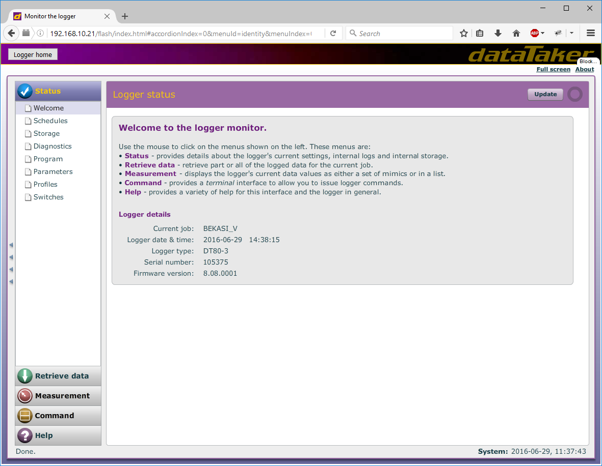
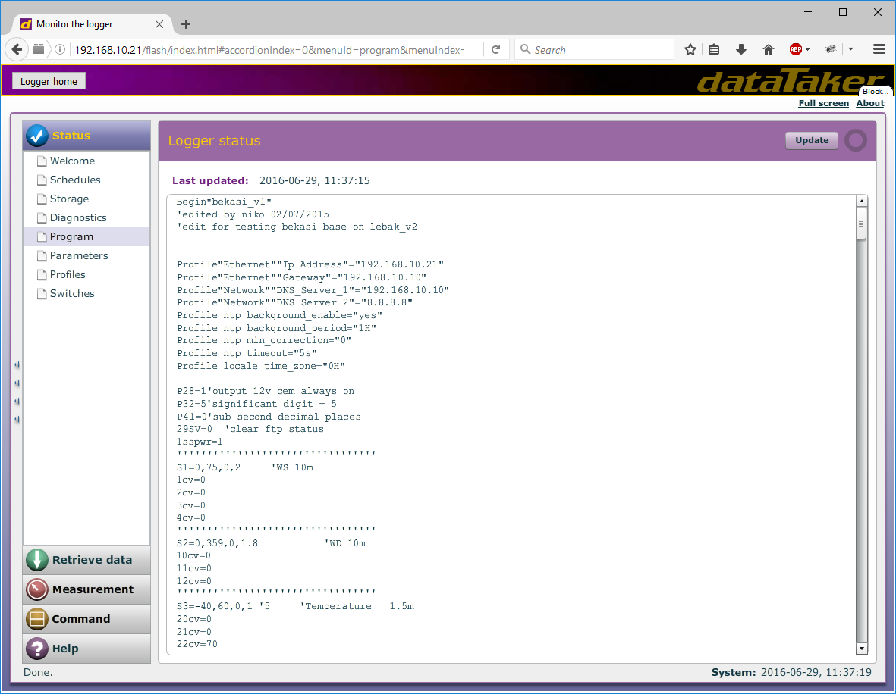
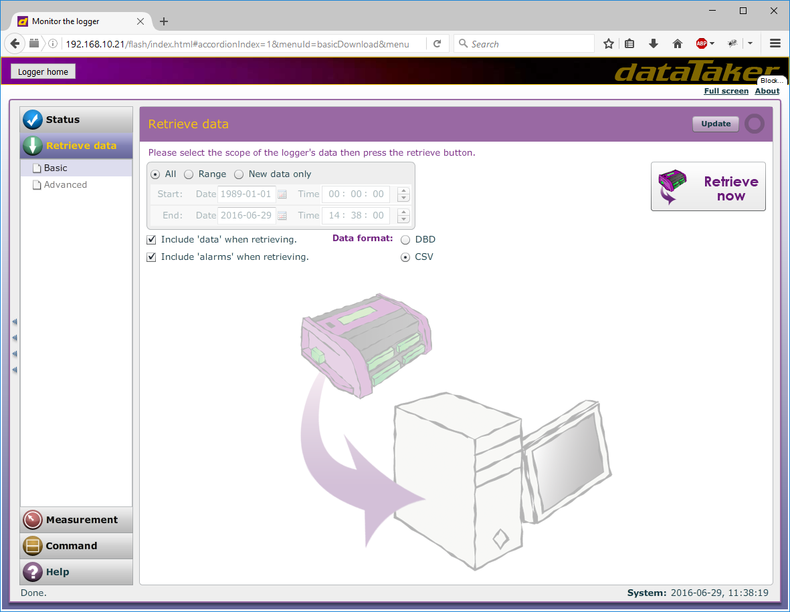
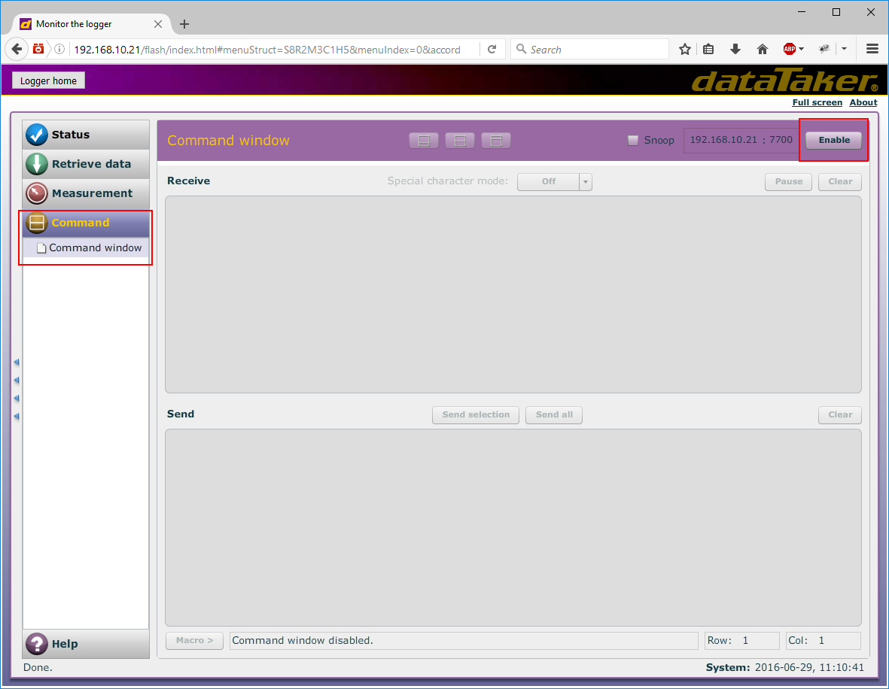
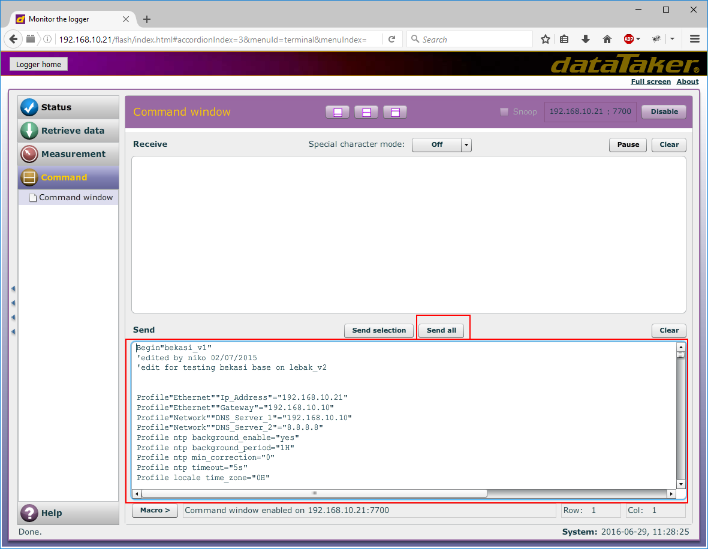
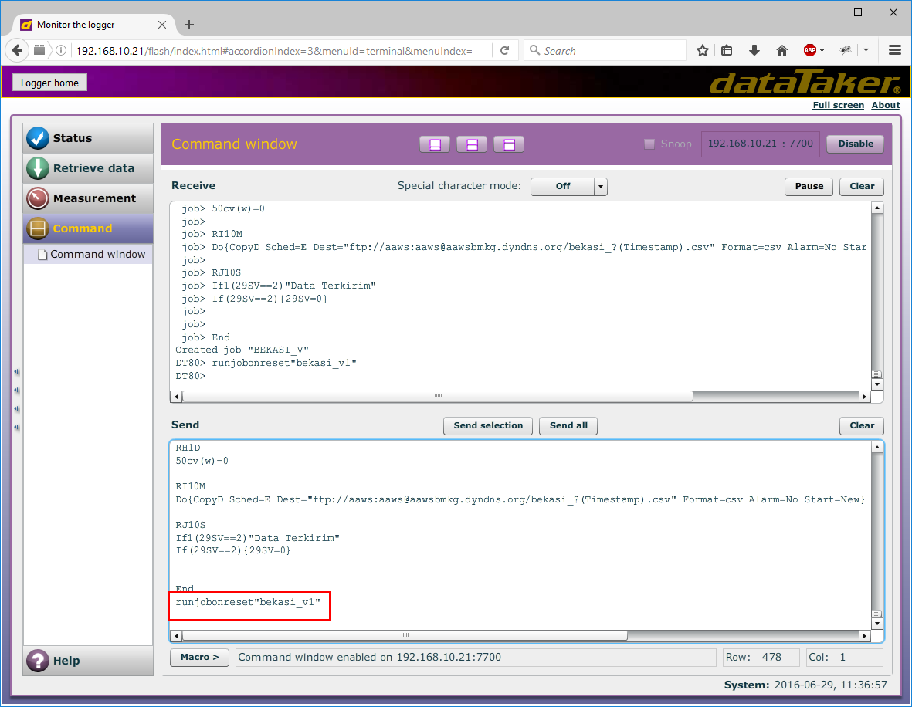

# Data Taker DT80 Series
***

!!! important
    Commands ke logger yang sering digunakan:

    `1` Setting date: {==d=dd/mm/yyyy==}

    `2` Setting time: {==t=hh:mm:ss==}

    `3` Mengetahui program yang sedang dijalankan: {==curjob==}

    `4` Menghapus program: {==delalljobs==}

- [X] Lakukan koneksi antara data logger dengan notebook melalui kabel LAN

- [X] Akses halaman konfigurasi data logger melalui browser di `192.168.10.21`. Pilih menu `Monitor the logger`

: {: loading=lazy }

- [X] Cek tanggal dan waktu pada data logger.

: {: loading=lazy }

    Bila tidak sesuai dengan tanggal dan waktu terbaru dalam format UTC maka dapat dilakukan update melalui command dengan mengetikan perintah:

    * Untuk setting tanggal: `d=dd/mm/yyyy` (contoh: d=01/01/2020) 
    * Untuk setting waktu: `t=hh:mm:ss` (contoh: t=01:02:03)

- [X] Lakukan backup program/script data logger dengan cara copy-paste program/script dari data logger ke teks editor (seperti notepad) lalu simpan dalam format `*.txt`. Pilih menu `Status` > `Program` untuk melakukan backup script program yang ada melalui blok semua lalu copy script tersebut ke teks editor untuk disimpan

: {: loading=lazy }

- [X] Bila diperlukan, pilih menu `Retrieve data` untuk download data dari data logger. Tentukan range yang diinginkan, pilih format `*.csv` lalu klik `Retrieve now`

: {: loading=lazy }

- [X] Bila ingin melakukan perubahan pada tanggal, waktu ataupun upload script program ke data logger dapat dilakukan di bagian `Command` > `Enable`. Pada logger Data Taker dengan firmware v9++, check juga `Append Data`

: {: loading=lazy }

- [X] Jika program data logger tidak ada/kosong maka dapat dilakukan pemrograman kembali dengan copy-paste program backup versi sebelumnya di halaman Command lalu pilih `Send all`

: {: loading=lazy }

!!! important
    Jika melakukan Copy Paste script program, pastikan pada akhir script program (setelah `End`) wajib ditambahkan baris {==**Runjobonreset"nama_program"**==}
    : {: loading=lazy }

- [X] Setelah semua konfigurasi selesai, lalukan pengecekan ulang pada data logger dengan mematikan data logger lalu nyalakan data logger kembali, klik tombol {==panah kebawah==}. {==Perhatikan pada display data logger bila nama  script program sudah tampil maka data logger sudah dapat melakukan akuisisi data. Bila muncul “no current job” maka lakukan upload script program kembali.==}

For full documentation visit [thermofisher.com](https://www.thermofisher.com/id/en/home/industrial/manufacturing-processing/data-acquisition/data-acquisition-resources.html)
