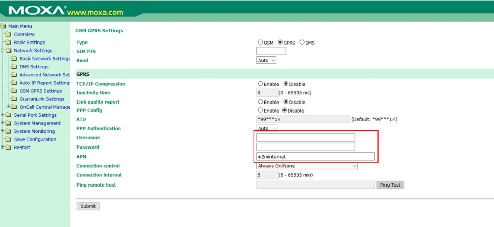

# Modems
***

## Moxa

`1` Akses halaman konfigurasi modem melalui browser di `192.168.10.10`

`2` Pada menu sidebar kiri (Main Menu) pilih `Network Settings` > `GSM GPRS Settings` 

`3` Lalu isikan APN, Username dan Password sesuai dengan operator yang digunakan

!!! note
    {: loading=lazy }

`4` Klik `Submit` untuk menyimpan perubahan yang telah dilakukan

## Robustel

`1` Pada web browser ketik alamat: `192.168.10.10`

`2`	Lalu login dengan user: `admin` dan password: `admin`

`3`	Setting APN, Username dan Password dari simcard yang digunakan untuk koneksi internet.

    •	Pilih Menu cellular WAN
    •	Pilih SIM 1 atau 2 (tempat simcard diletakkan)
    •	Network Provider Type: Custom
    •	Isi APN: sesuai APN simcard/M2M
    •	Username dan Password: kosongkan (atau di isi sesuai simcard M2M)
    •	Dial Up: kosongkan
    •	Pin Type: None

`4`	Lalu klik Apply > Save 

`5`	Reboot

`6`	Jika APN dan konfigurasi berhasil maka indicator sinyal di modem akan muncul level 2-3 Bar

## InHand

`1`	Pada web browser ketik alamat: `192.168.10.10`

`2`	Lalu login dengan user: `adm` dan password: `123456`

`3`	Setting APN, Username dan Password dari simcard yang digunakan untuk koneksi internet.

    •	Pilih Menu Setting APN > Network > Dial up 
    •	Isi APN: sesuai APN simcard/M2M
    •	Username dan Password: kosongkan (atau di isi sesuai simcard M2M)
    •	Dial Up: kosongkan
    •	Network type: Auto
    •	Connection Mode: Always Online

`4`	Lalu klik Apply/Save/Submit 

`5`	Reboot
