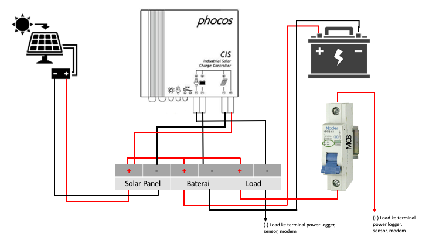
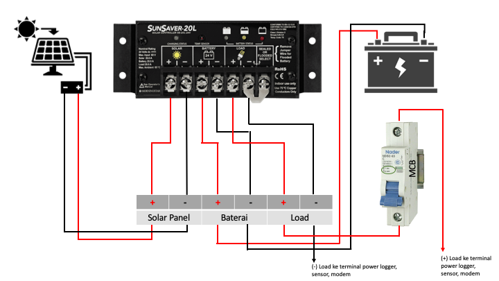
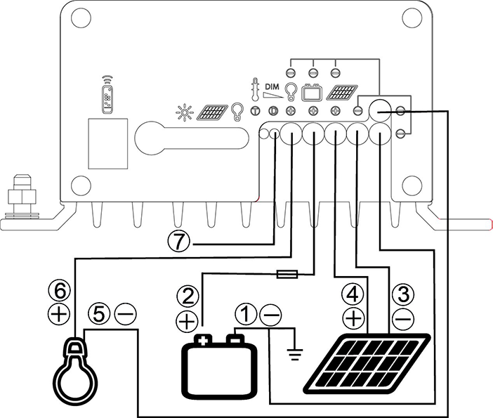
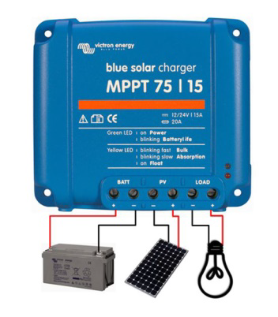

# Skema Sistem Power
***

!!! attention
    1.  Jika pada sistem power AAWS masih ada sekering maka {==sekering harus dicabut==}.
    2.  Setelah sekering dicabut, masing-masing kabel dari solar panel dan baterai dihubungkan 
    langsung ke solar regulator sesuai dengan slot-slotnya.
    3.  Load+ dari solar regulator {==harus dipasang MCB (6A)==} terlebih dahulu sebelum dipasang ke 
    terminal logger, modem dan sensor.
    4.  Pemasangan kabel Load+ pada MCB agar disesuaikan dengan posisi OFF-ON yang tertera pada 
    setiap merk MCB.

## Solar Regulator Phocos PWM

{: loading=lazy }

## Solar Regulator SunSaver PWM/Lainnya

{: loading=lazy }

## Solar Regulator Phocos MPPT

{: loading=lazy }

!!! info
    * 1 - Negative battery terminal
    * 2 - Positive battery terminal
    * 3 - Negative panel terminal
    * 4 - Positive panel terminal
    * 5 - Negative load terminal
    * 6 - Positive load terminal
    * 7 - Dimming signal terminal

!!! hint
    - [X] Solar LED Status
        * ON - Charging failure (overvoltage / overcurrent)
        * OFF - Charging OK

    - [X] Battery LED Status
        * ON - Controller connected to battery, night detected
        * FLASH - Controller connected to battery, day detected
        * OFF - No battery connected

    - [X] Load LED Status
        * ON - Load low/high voltage disconnect (LVD/HVD)
        * FLASH - Load overcurrent
        * OFF - Load OK

## Solar Regulator Victron MPPT

{: loading=lazy }

!!! info
    Download {==**Victron Connect**==} di [App Store]((https://itunes.apple.com/us/app/victron-connect/id943840744?mt=8)) atau [Play Store](https://play.google.com/store/apps/details?id=com.victronenergy.victronconnect) lalu lakukan pairing bluetooth. Gunakan {==**Password: 000000**==} bila diminta.
    

        <iframe width="560" height="315" src="https://www.youtube.com/embed/6Ir0WBPTJ3A" frameborder="0" allow="accelerometer; autoplay; clipboard-write; encrypted-media; gyroscope; picture-in-picture" allowfullscreen></iframe>
    

     
    

        <iframe width="560" height="315" src="https://www.youtube.com/embed/XQea9aO2uVI" frameborder="0" allow="accelerometer; autoplay; clipboard-write; encrypted-media; gyroscope; picture-in-picture" allowfullscreen></iframe>
    
