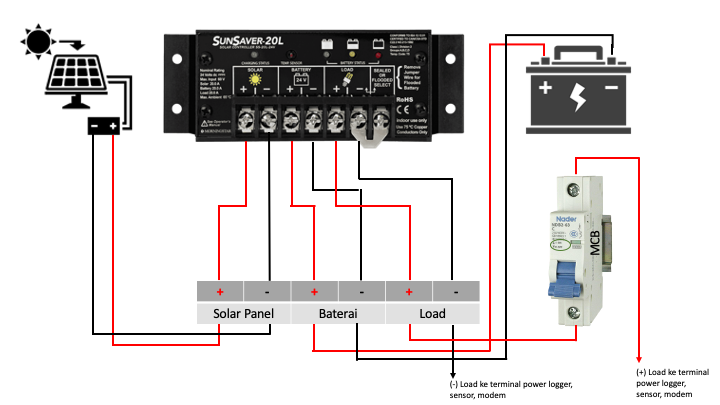

# Skema Sistem Daya AAWS
***
## Solar Regulator Phocos

## Solar Regulator Lainnya

!!! note
1.  Jika pada sistem power AAWS masih ada {==sekering maka harus dicabut==}.
2.  Setelah sekering dicabut, masing-masing kabel dari solar panel dan baterai dihubungkan 
    langsung ke solar regulator sesuai dengan slot-slotnya.
3.  Load+ dari solar regulator {==harus dipasang MCB (6A)==} terlebih dahulu sebelum dipasang ke 
    terminal logger, modem dan sensor.
4.  Pemasangan kabel Load+ pada MCB agar disesuaikan dengan posisi OFF-ON yang tertera pada 
    setiap merk MCB.