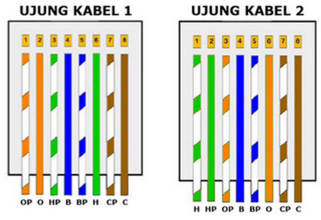
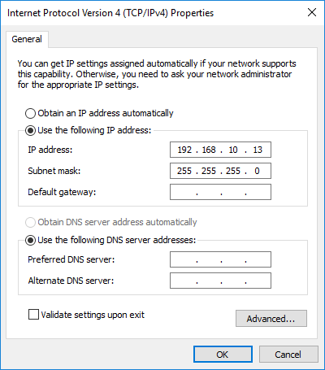

# Tools
***

Berikut merupakan beberapa alat yang harus disiapkan sebelum melaksanakan kegiatan pemeliharaan peralatan AAWS, antara lain:

- [x] `Kabel LAN` - Tipe cross

: !!! attention
        **Harap membawa kabel LAN sendiri. Khususnya modem InHand, kabel LAN dapat langsung dikoneksikan ke port di modem sehingga tidak mencabut kabel LAN yang sudah ada**

: !!! info
        Jika ingin membuat kabel LAN tipe cross, pakailah petunjuk konfigurasi kabel gambar berikut:

: {: loading=lazy }

- [x] `Notebook/Laptop` - OS Windows, port/converter LAN

: Lakukan setting IP Address pada Notebook/laptop dengan IP dan Subnet mask berikut:

: {: loading=lazy }

- [x] `Toolkit` - Toolkit set lengkap, kabel ties, double tape, kuas

- [x] `Safety` - Safety belt, safety shoes, safety helmet, sarung tangan anti statis

- [x] `Multimeter` - Tipe digital

- [x] `Spare Parts` - Suku cadang yang diperlukan

- [x] `Lainnya` - Kapur semut, wet tissue, dan penunjang lainnya
