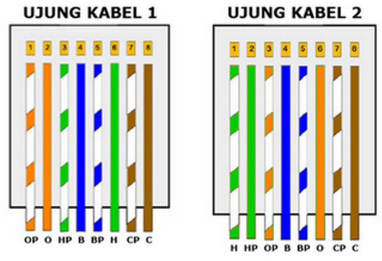

# Tools
***
Berikut merupakan beberapa hal yang harus disiapkan sebelum melaksanakan kegiatan pemeliharaan peralatan AAWS, antara lain:

* `Notebook/Laptop` - OS Windows, port/converter LAN.
* `Kabel LAN` - Tipe cross.
* `Toolkit` - Toolkit set lengkap, kabel ties, double tape, kuas.
* `Safety` - Safety belt, safety shoes, safety helmet, sarung tangan anti statis.
* `Multimeter` - Tipe digital.
* `Spare Parts` - Suku cadang yang diperlukan.
* `Lainnya` - Kapur semut, wet tissue, dan penunjang lainnya.

## Kabel LAN Cross

!!! info
    Jika ingin membuat kabel LAN tipe cross, pakailah petunjuk konfigurasi kabel gambar berikut:

